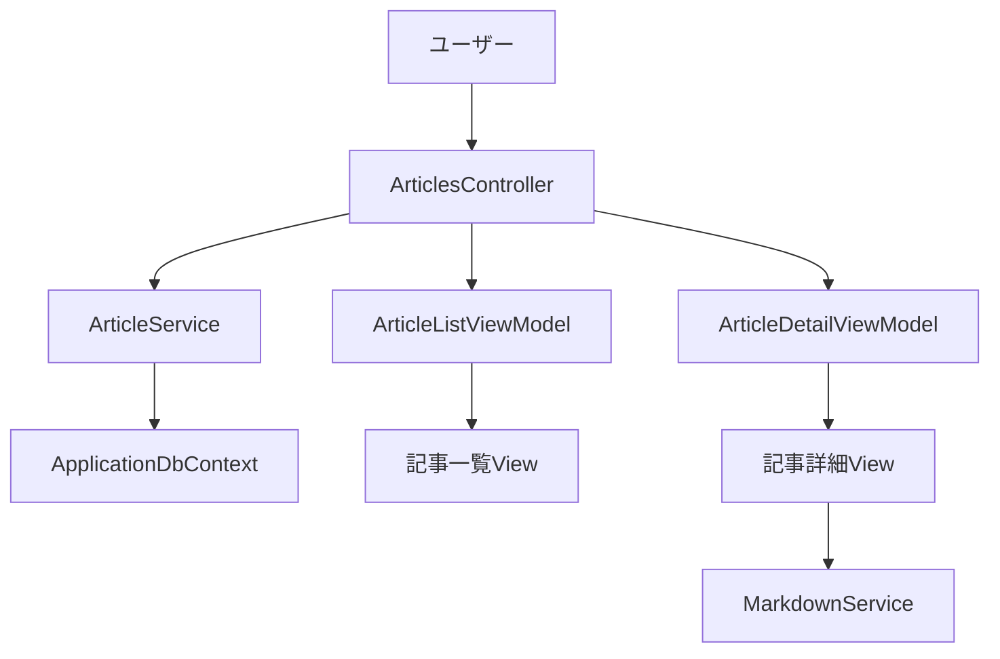
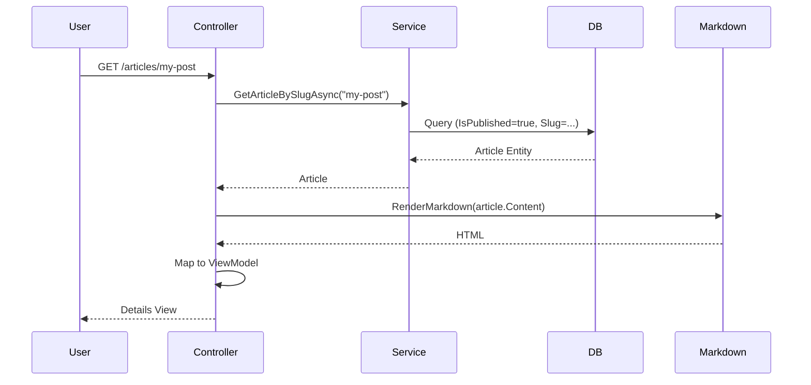

# 一般ユーザー向け記事閲覧機能 - 実装計画書

作成日: 2026-01-18

## 1. 現状の把握

### 既存実装
- ✅ Admin記事管理機能（CRUD）
- ✅ `ArticleService`（`GetPublishedArticlesAsync`, `GetArticleBySlugAsync`等のメソッド実装済み）
- ✅ `Article`エンティティ（`IsPublished`, `PublishedAt`, `Slug`フィールドあり）
- ✅ `MarkdownService`（Markdigによるレンダリング）
- ✅ カテゴリ・タグ機能

### 未実装
- ❌ 一般ユーザー向けController
- ❌ 公開記事一覧・詳細表示のView
- ❌ 一般ユーザー向けViewModel
- ❌ 記事閲覧用ルーティング

## 2. 実装するもの



### 必要なコンポーネント

| コンポーネント | ファイルパス | 役割 |
|--------------|-------------|------|
| Controller | `Controllers/ArticlesController.cs` | 一般ユーザー向けリクエスト処理 |
| ViewModel (一覧) | `Models/ViewModels/ArticleListViewModel.cs` | 記事一覧表示用 |
| ViewModel (詳細) | `Models/ViewModels/ArticleDetailViewModel.cs` | 記事詳細表示用 |
| View (一覧) | `Views/Articles/Index.cshtml` | 記事一覧画面 |
| View (詳細) | `Views/Articles/Details.cshtml` | 記事詳細画面 |
| ルーティング | `Program.cs`に追加 | `/articles`, `/articles/{slug}` |

## 3. 実装の流れ

### Phase 1: ViewModel作成
- [ ] `ArticleListViewModel.cs` - 一覧表示用
- [ ] `ArticleDetailViewModel.cs` - 詳細表示用

### Phase 2: Controller実装
- [ ] `ArticlesController.cs` - `Index()`, `Details(slug)`

### Phase 3: View作成
- [ ] `Index.cshtml` - カード形式の記事一覧
- [ ] `Details.cshtml` - Markdown表示とメタ情報

### Phase 4: ルーティング設定
- [ ] `Program.cs`に記事専用ルート追加

## 4. 各コンポーネントの詳細

### 4.1 Controller設計

**ファイル**: `Controllers/ArticlesController.cs`

```csharp
public class ArticlesController : Controller
{
    private readonly IArticleService _articleService;
    private readonly MarkdownService _markdownService;

    // GET: /articles
    public async Task<IActionResult> Index()
    
    // GET: /articles/{slug}
    public async Task<IActionResult> Details(string slug)
}
```

**メソッド**:
- `Index()`: 公開記事一覧（公開日降順、ページネーション対応予定）
- `Details(string slug)`: スラッグ指定で記事詳細表示

### 4.2 ViewModel設計

**ArticleListViewModel.cs**
```csharp
public class ArticleListViewModel
{
    public int Id { get; set; }
    public string Title { get; set; }
    public string Slug { get; set; }
    public string? Excerpt { get; set; }
    public string? FeaturedImageUrl { get; set; }
    public string? CategoryName { get; set; }
    public string AuthorName { get; set; }
    public DateTime PublishedAt { get; set; }
}
```

**ArticleDetailViewModel.cs**
```csharp
public class ArticleDetailViewModel
{
    public int Id { get; set; }
    public string Title { get; set; }
    public string Slug { get; set; }
    public string RenderedContent { get; set; } // HTMLレンダリング済み
    public string? CategoryName { get; set; }
    public List<string> TagNames { get; set; }
    public string AuthorName { get; set; }
    public DateTime PublishedAt { get; set; }
}
```

### 4.3 View構成

**Index.cshtml (記事一覧)**
- カードレイアウト（Bootstrap）
- 表示項目: タイトル、抜粋、カテゴリ、著者、公開日
- Detailsへのリンク（スラッグベース）

**Details.cshtml (記事詳細)**
- 記事メタ情報（タイトル、著者、カテゴリ、タグ、公開日）
- Markdownレンダリング済みコンテンツ（`@Html.Raw()`）
- OGP対応（将来拡張）

### 4.4 ルーティング設定

**Program.cs**に以下を追加（adminルートの前に配置）:

```csharp
// 記事詳細用ルート (スラッグベース)
app.MapControllerRoute(
    name: "article_details",
    pattern: "articles/{slug}",
    defaults: new { controller = "Articles", action = "Details" });

// 記事一覧用ルート
app.MapControllerRoute(
    name: "articles",
    pattern: "articles",
    defaults: new { controller = "Articles", action = "Index" });
```

**URL例**:
- 一覧: `/articles`
- 詳細: `/articles/my-first-blog-post`

## 5. データフロー



## 6. 注意点とベストプラクティス

### セキュリティ
- ✅ `IsPublished=true`のみ取得（下書き記事を非公開）
- ✅ `IsDeleted=false`で削除記事を除外（`ArticleService`で既に実装済み）
- ⚠️ `@Html.Raw()`使用時はXSS対策（Markdigがサニタイズ済み）

### パフォーマンス
- ✅ `Include()`でナビゲーションプロパティを一括ロード（N+1問題回避）
- 💡 将来: Redis等でキャッシュ実装

### UX
- 📱 レスポンシブデザイン（Bootstrapグリッド活用）
- 🔍 記事が見つからない場合は404ページ表示
- 🎨 コード構文ハイライト（Markdigの拡張機能検討）

### コーディング規約
- ViewModelは`Models/ViewModels/`配下
- 日本語エラーメッセージ（ただし一般ユーザー向けなので最小限）
- 非同期メソッド（`async/await`）必須

## 7. 将来の拡張ポイント

### Phase 2以降
- [ ] ページネーション（1ページ10-20記事）
- [ ] カテゴリ・タグフィルタリング
- [ ] 検索機能（`SearchArticlesAsync`活用）
- [ ] コメント機能（認証ユーザーのみ）
- [ ] OGP/SEOメタタグ
- [ ] RSS/Atomフィード
- [ ] 記事シェアボタン（SNS連携）

### 検討事項
- **キャッシュ戦略**: 公開記事は頻繁に変わらないため、メモリキャッシュ有効
- **画像最適化**: FeaturedImageの遅延読み込み
- **アクセス解析**: Application Insightsとの統合

---

## チェックリスト

実装時のタスクリスト:

- [ ] `ArticleListViewModel.cs`作成
- [ ] `ArticleDetailViewModel.cs`作成
- [ ] `ArticlesController.cs`作成（`Index`, `Details`メソッド）
- [ ] `Views/Articles/Index.cshtml`作成
- [ ] `Views/Articles/Details.cshtml`作成
- [ ] `Program.cs`にルーティング追加
- [ ] 既存の`ArticleService`のメソッド動作確認（`GetPublishedArticlesAsync`等）
- [ ] ブラウザで動作確認（`/articles`, `/articles/{slug}`）
- [ ] 404処理のテスト（存在しないスラッグ）
- [ ] レスポンシブデザインの確認
